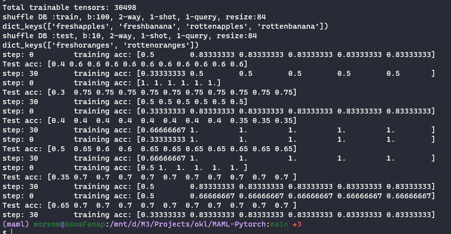

#  MAML-Pytorch
PyTorch implementation of the supervised learning experiments from the paper:
[Model-Agnostic Meta-Learning (MAML)](https://arxiv.org/abs/1703.03400).

> Version 1.0: Both `MiniImagenet` and `Omniglot` Datasets are supported! Have Fun~

> Version 2.0: Re-write meta learner and basic learner. Solved some serious bugs in version 1.0.

For Tensorflow Implementation, please visit official [HERE](https://github.com/cbfinn/maml) and simplier version [HERE](https://github.com/dragen1860/MAML-TensorFlow).

For First-Order Approximation Implementation, Reptile namely, please visit [HERE](https://github.com/dragen1860/Reptile-Pytorch).


# Platform
- python: 3.x
- Pytorch: 0.4+

# MiniImagenet


## Howto

For 6-way 1-shot exp., it allocates nearly 1GB GPU memory.

1. download `Fruits fresh and rotten for classification` dataset from [here](https://www.kaggle.com/sriramr/fruits-fresh-and-rotten-for-classification)
2. extract it like:
```shell
dataset/
├── train/
	freshapples/
		├── n0210891500001298.jpg  
		├── n0287152500001298.jpg 
		...
	freshbanana/
	rottenapples/
	rottenbanana/
├── test/
	freshapples/
	freshbanana/
	rottenapples/
	rottenbanana/

```
3. modify the `arguments` in `terminal`:
```python
        usage: rotten_train.py [-h] [--n_way N_WAY] [--k_spt K_SPT] [--k_qry K_QRY]
                       [--path PATH] [--batch BATCH] [--epoch EPOCH]
                       [--imgsz IMGSZ] [--imgc IMGC] [--task_num TASK_NUM]
                       [--meta_lr META_LR] [--update_lr UPDATE_LR]
                       [--update_step UPDATE_STEP]
                       [--update_step_test UPDATE_STEP_TEST]

optional arguments:
  -h, --help            show this help message and exit
  --n_way N_WAY         n way
  --k_spt K_SPT         k shot for support set
  --k_qry K_QRY         k shot for query set
  --path PATH           path to the dataset
  --batch BATCH         epoch number
  --epoch EPOCH         epoch number
  --imgsz IMGSZ         imgsz
  --imgc IMGC           imgc
  --task_num TASK_NUM   meta batch size, namely task num
  --meta_lr META_LR     meta-level outer learning rate
  --update_lr UPDATE_LR
                        task-level inner update learning rate
  --update_step UPDATE_STEP
                        task-level inner update steps
  --update_step_test UPDATE_STEP_TEST
                        update steps for finetunning
```
to your actual data path.

4. just run `python miniimagenet_train.py` and the running screenshot is as follows:


If your reproducation perf. is not so good, maybe you can enlarge your `training epoch` to get longer training. And MAML is notorious for its hard training. Therefore, this implementation only provide you a basic start point to begin your research.
and the performance below is true and achieved on my machine.


# References
```
@misc{MAML_Pytorch,
  author = {Liangqu Long},
  title = {MAML-Pytorch Implementation},
  year = {2018},
  publisher = {GitHub},
  journal = {GitHub repository},
  howpublished = {\url{https://github.com/dragen1860/MAML-Pytorch}},
  commit = {master}
}
```
